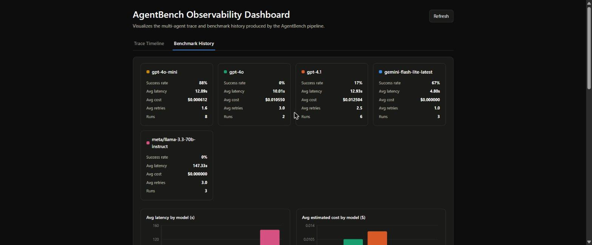

# AgentBench — Governed Multi-Agent Data Analysis & Benchmarking Pipeline

A small but complete **multi-agent system**, built with **LangGraph**, that plans, executes, quality-checks and reports on data-analysis tasks — while systematically **benchmarking which model/agent configuration gets the best result for the lowest cost**.

The project was built as a practical showcase for agentic AI / multi-agent engineering work: governance of agent roles, reusable skills, guardrails, QA integration, and empirical benchmarking of models and workflow variants.

## Why this project

It intentionally mirrors the core responsibilities of an "Agentic AI / Multi-Agent Systems" role:

| Responsibility | Where it lives in this repo |
|---|---|
| Co-develop AI agents for engineering/enterprise tasks | `src/agents/` — Planner, Analyst, Reviewer, Reporter |
| Governance: agent definitions, role descriptions, guardrails, reusable skills | `docs/GOVERNANCE.md`, `src/guardrails.py`, `src/skills/` |
| Structure & optimize agent workflows for quality, traceability, efficiency | `src/graph.py` (LangGraph `StateGraph`, typed state, full run trace) |
| Integrate QA mechanisms (security, code quality, plausibility) | `src/skills/static_analysis.py`, `src/skills/plausibility.py` |
| Benchmark & validate models/agents/workflow variants against defined criteria | `benchmarks/run_benchmark.py` |
| Translate findings into a working PoC | this whole repo |
| Document methods, interfaces, results | `docs/`, docstrings, `benchmarks/results/` |

## Architecture

```
                     ┌─────────────┐
   user question  →  │   Planner   │  breaks the analysis goal into steps
                     └──────┬──────┘
                            ▼
                     ┌─────────────┐
                     │   Analyst   │  writes & executes pandas code (sandboxed)
                     └──────┬──────┘
                            ▼
                     ┌─────────────┐
                     │  Reviewer   │  guardrails + static analysis + plausibility check
                     └──────┬──────┘
                       fail │ pass
                    ┌───────┴────────┐
                    ▼                ▼
             back to Analyst   ┌─────────────┐
             (max 2 retries)   │  Reporter   │  writes the final markdown report
                               └─────────────┘
```

Every node reads/writes a single typed `AgentState` object, so the whole run is traceable end-to-end (see `src/graph.py`).

## Quickstart

```bash
python -m venv .venv && source .venv/bin/activate
pip install -r requirements.txt
cp .env.example .env   # add your OPENAI_API_KEY (or swap the model client)

python main.py --data data/sample_sales.csv --question "Which product category has the strongest revenue growth trend, and is it statistically robust or driven by outliers?"
```

Output: a run trace in the console plus `outputs/report.md`.

### Using other model providers

`--model` accepts any of the following, picked by `src/llm_providers.py` from the name alone — no other flag needed:

| Model name pattern | Provider | Example | Requires |
|---|---|---|---|
| anything else | OpenAI | `gpt-4o-mini`, `gpt-4.1` | `OPENAI_API_KEY` |
| `gemini-*` | Google AI Studio | `gemini-flash-lite-latest` | `GOOGLE_API_KEY` (free tier — [aistudio.google.com/apikey](https://aistudio.google.com/apikey)) |
| `org/model` (contains a `/`) | NVIDIA NIM (OpenAI-compatible) | `meta/llama-3.3-70b-instruct` | `NVIDIA_API_KEY` (free tier — [build.nvidia.com](https://build.nvidia.com)) |

```bash
python main.py --data data/sample_sales.csv --question "..." --model gemini-flash-lite-latest
```

Note on free tiers: Pro/full-size tiers (e.g. `gemini-2.5-pro`) typically have near-zero free quota and will 429 under this pipeline's multi-call-per-run load — Flash/Lite tiers (e.g. `gemini-flash-lite-latest`) have a much more usable free quota. NVIDIA NIM's free tier also enforces a low concurrent-request cap shared across models.

## Benchmarking models & configurations

```bash
python benchmarks/run_benchmark.py
```

This runs the same task across multiple model configurations — by default `gpt-4o-mini`, `gpt-4.1`, `gemini-flash-lite-latest`, and `meta/llama-3.3-70b-instruct`, spanning three different providers — and scores each run on **correctness, guardrail pass rate, latency, and estimated token cost**, appending every run to `benchmarks/results/history.jsonl` (never overwritten) so trends across runs are visible, e.g. in the [Observability Dashboard](#observability-dashboard) below. The goal, per the job spec, is finding the smallest/cheapest model that still clears the quality bar — not just the most capable one. One provider's outage or rate limit doesn't take down the whole run: `run_benchmark.py` catches per-model errors and records them as a failed result rather than crashing.

## Observability Dashboard

A small local React + FastAPI dashboard visualizes the data this repo already produces — no new source of truth, just a visual layer on top of `outputs/trace.json` and `benchmarks/results/history.jsonl`:

- **Trace timeline** — the step-by-step Planner → Analyst → Reviewer → Reporter trace from your most recent `python main.py ...` run, with pass/fail color coding and Analyst↔Reviewer retry loops grouped together.
- **Report** — the final markdown report from that same run (`outputs/report.md`), rendered in place: each step's code, result, and natural-language interpretation, plus any outlier-scrutiny flags. The trace shows *how* the pipeline got there; the report shows *what* it concluded.
- **Benchmark history** — every past `python benchmarks/run_benchmark.py` run (not just the latest), with per-model KPI cards (success rate, avg latency, avg cost, avg retries) and charts comparing models and trending latency/cost over time — the visual version of "find the smallest model that still clears the quality bar."

Run the backend (from the repo root, with the project venv active):

```bash
pip install -r dashboard/backend/requirements.txt
uvicorn dashboard.backend.main:app --reload --port 8000
```

Run the frontend (separate terminal):

```bash
cd dashboard/frontend
npm install
npm run dev
```

Then open the printed Vite URL (typically `http://localhost:5173`). The dashboard reads `outputs/trace.json` and `benchmarks/results/history.jsonl` directly off disk — run `main.py` and `benchmarks/run_benchmark.py` at least once first, and hit the Refresh button after each new run.



## Project layout

```
agentic-data-bench/
├── docs/
│   └── GOVERNANCE.md        # agent roles, guardrails spec, skill registry
├── src/
│   ├── agents/               # one file per agent role
│   ├── skills/                # reusable, testable capabilities agents call
│   ├── guardrails.py          # centralized guardrail policy + enforcement
│   └── graph.py                # LangGraph workflow definition
├── benchmarks/
│   └── run_benchmark.py       # multi-model / multi-config evaluation harness
├── dashboard/
│   ├── backend/                # FastAPI app + pure data.py (see Observability Dashboard above)
│   └── frontend/                # React (Vite) trace timeline + benchmark history UI
├── tests/                      # unit tests for guardrails, skills & dashboard data
├── data/sample_sales.csv       # toy dataset for the demo
└── main.py                     # CLI entry point
```

## Notes on scope

This is a deliberately compact reference implementation — built to demonstrate the *patterns* (governance, guardrails, reusable skills, QA-in-the-loop, benchmarking) clearly and correctly, not to be a production system. Extending it (more agents, a real sandbox executor, a vector-store skill, async parallel benchmarking) would be natural next steps.
